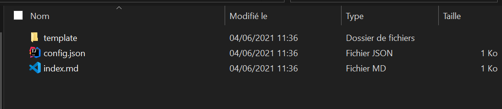
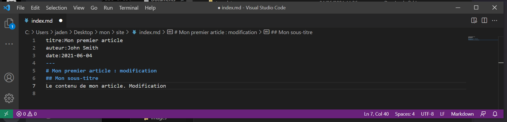
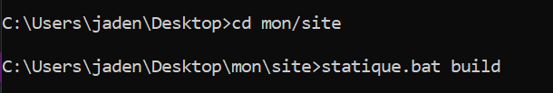
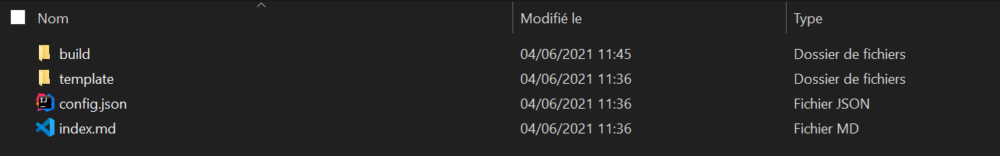
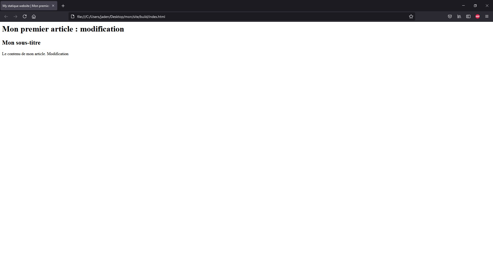
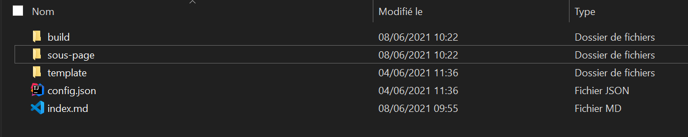
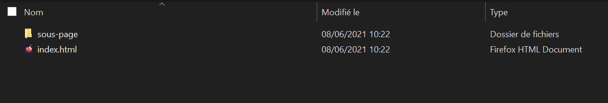

# Site statique : manuel utilisateur 


## Installation

Dans un premier temps, télécharger le fichier zip du projet de Github. Extraire le projet et le placer dans un emplacement au choix. Se placer ensuite dans le dossier au niveau de "projet-vallon_groeli_gonzalezleon-master/projet-vallon_groeli_gonzalezleon-master/SiteStatique"  (s'assurer que ce soit bien le dossier qui contient le pom.xml) et exécuter les commandes suivantes dans le shell de git :

```shell
mvn clean install \
    && rm -fr statique \
    && unzip target/statique.zip

```

Passer ensuite dans powershell et exécuter la commande suivante :

` $env:Path += ";VotrePathVersLeDossierbinQueVousAvezExtraitdansStatique"`

Il est possible d'ajouter directement cette adresse dans le PATH de votre pc pour ne plus avoir besoin d'effectuer à chaque fois cette partie.

**L'application peut maintenant être appelée avec `statique.bat` sur powershell ou simplement `statique` sur bash.**


## Liste des commandes 

**Pour appeler une des sous commandes il faut les mettre derrière l'appel à statique.bat : statique.bat clean par exemple.**

- `statique -v` ou `statique --version` : afficher la version du générateur de site statique 
- `statique -h` ou `statique --help` :  pour obtenir de l'aide sur les commandes init, build, clean et serve. 
- `statique init <nom dossier>` : créer le dossier de base contenant le fichier index markdown et le fichier de configuration json dans un sous dossier. 
- `statique init -m <nom dossier>` ou `statique init --markdown <nom dossier>`  : génère simplement un nouveau fichier index markdown dans un dossier déjà existant.
- `statique build` : construire le site statique et générer le dossier build
- `statique build-p=<path>` : construire le site statique à un vers un chemin donné 
- `statique clean` : supprime le dossier build
- `statique serve` : ouvre un navigateur pour visualiser le résultat du site statique


## Exemple d'utilisation

L'application statique permet, en utilisant 4 commandes, d'initialiser, de créer, de gérer et de visualiser l'état du site statique. L'application est donc composée d'une commande principale, **statique**, et de 4 sous commandes principales, **init**, **build**, **clean** et **serve**. 

Un exemple d'utilisation de l'application est le suivant :

1. Créer le dossier contenant le fichier markdown et json contenant les informations de la page principale en utilisant la commande init. Par exemple utiliser `statique init /mon/site`.

Résultat obtenu dans le terminal Window :


Dans le répertoire /mon/site on obtient le résultat suivant :



Le dossier template contient le fichier layout.html.

2. Modifier les fichiers markdown et/ou json, pour ajouter du contenu au site et modifier son header.

Dans l'exemple qui suit on modifie le fichier index.md. Se référer à la section plus bas pour les différents fichiers modifiables et les différentes parties du fichier qui sont modifiables par l'utilisateur. 



3. Construire le site en utilisant la commande `statique build`. Le document html index.html créé sera placé dans un dossier build lui aussi nouvellement créé.



On obtient donc le répertoire suivant :




4. Visualiser le résultat dans le navigateur web par défaut avec la commande *statique serve*, pour observer le résultat final après avoir effectué d'éventuelles modifications :




5. Nettoyer le projet avec `statique clean`, c'est-à-dire supprimer le dossier build pour pouvoir le reconstruire entièrement par la suite en relançant un build (pouvoir par exemple visualiser le résultat des modifications).
6. L'utilisateur peut choisir de générer plusieurs pages html. Pour cela il faut créer un nouveau répertoire à la base du projet créé par init et lancer la `commande statique init -m <nom répertoire créé>` dans le sous dossier pour créer un nouveau fichier markdown. L'utilisateur peut modifier ce fichier à sa convenance puis lancer un clean suivi d'un build pour construire la sous page. 

Après avoir exécuté la commande :


On obtient le projet suivant :



Dans le dossier build on obtient un nouveau dossier contenant la page html :



La commande serve permet de visualiser uniquement le résultat de la page principale associé au fichier index.md de départ. Pour visualiser le résultat des sous-pages, il est nécessaire de créer des liens depuis la page principale vers les sous-pages.

7. A partir de ce point, dès que le résultat est satisfaisant, il n'y a plus qu'à utiliser le résultat html produit et le mettre dans un serveur. 

Ce cycle peut être répété autant que voulu.


## Fichiers modifiables :

Pour personnaliser le site statique, l'utilisateur peut modifier les fichiers suivants :

- tous les fichiers de type markdown : **attention tous les fichiers de ce type doivent avoir la même structure** : même titres de header suivi des 3 tirets après un retour à la ligne puis un autre retour à la ligne avec le contenu du site qui varie d'un fichier à l'autre. Pour résumer les titres du header doivent être les même mais les valeurs peuvent changer d'un fichier à l'autre et le body (après les 3 tirets et le retour à la ligne) est également complètement modifiable selon le fichier markdown. Le fichier markdown de la page principal doit obligatoirement garder le nom index.md mais tous les autres fichiers md qui sont créés sont nommés au choix par l'utilisateur. Les autres fichiers servent à définir les sous-pages du site. Pour chaque fichier markdown produit, une page html sera créée dans un sous-dossier de build après la compilation du site. 
- config.json : les valeurs de charset, keywords, siteTitle, domain et language peuvent soit être modifiés, soit être supprimés. Attention à bien entourer les valeurs de " ".
- template/layout.html : l'utilisateur peut modifier ou supprimer les valeurs entre triple accolades ou en ajouter. Les valeurs entre triple accolades doivent obligatoirement correspondre au titre d'une valeur du fichier config.json ou à un titre du header des fichiers du type markdown. 

